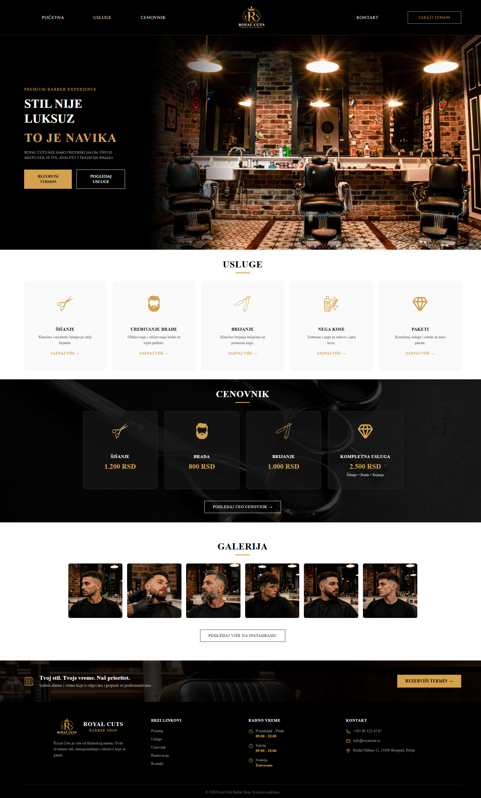

# Barber Booking App

A web application for booking appointments at a barbershop, built with React and Vite.

> 🚧 **Work in progress** — this project is under active development. Core UI is being built out; booking logic and backend integration are not implemented yet.

---

## Overview

This app will allow users to browse services, view pricing, and book an appointment at a barbershop — starting with a clean, responsive frontend before backend features are added.

## Preview



## Tech Stack

- **React** – UI library
- **Vite** – build tool & dev server
- **Oxlint** – linting

## Getting Started

Clone the repository and install dependencies:

```bash
git clone https://github.com/Filip-B0/barber-booking-app.git
cd barber-booking-app
npm install
npm run dev
```

The app will be available at `http://localhost:5173` (or the port shown in your terminal).

## Roadmap

- [ ] Service selection UI
- [ ] Appointment calendar
- [ ] Backend & database integration
- [ ] User authentication

## License

All rights reserved.